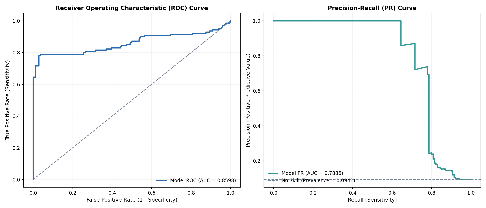
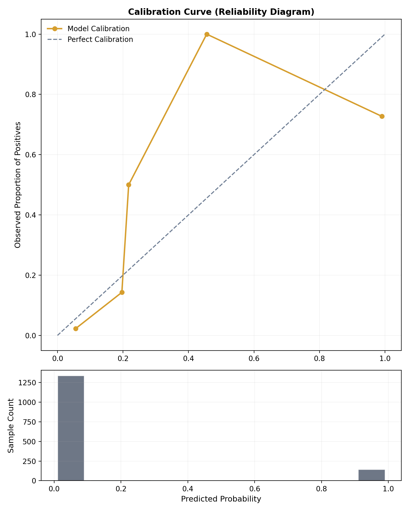
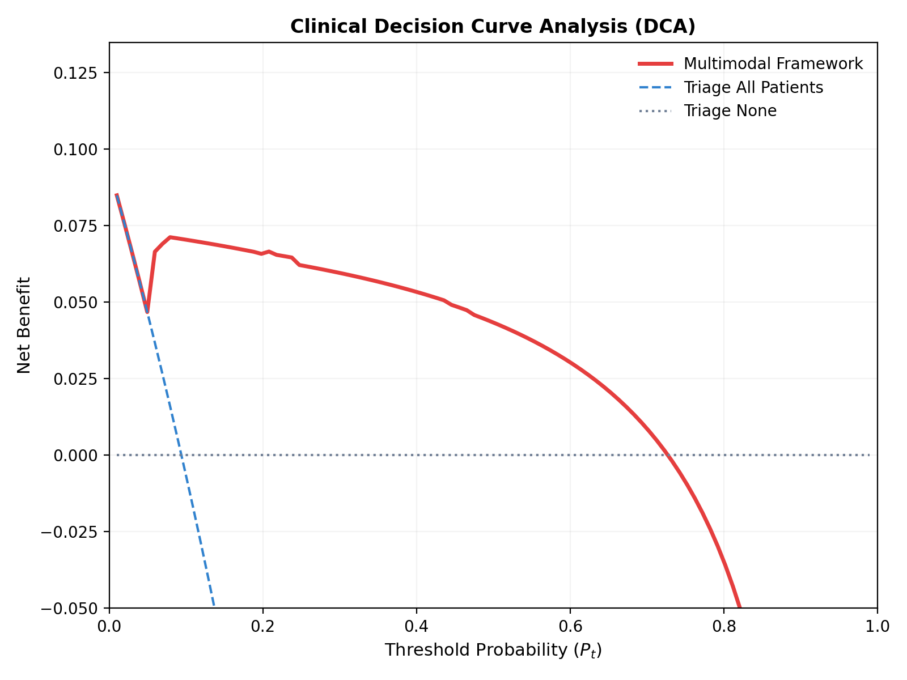

# A Lightweight Multimodal Cross-Attention Framework for ICU Risk Prediction Using Chest Radiographs and Physiological Time-Series

This repository contains the source code, weights, and evaluation metrics for a clinical-grade, edge-deployable multimodal model that predicts patient ICU escalation risk. By fusing **spatial features** from chest radiographs and **temporal trends** from 24-hour continuous vital signs, the framework achieves high-accuracy diagnostic performance with a tiny memory footprint (<6MB).

---

## 📊 Project Overview & Report

For a complete analysis of the methodology, dataset distribution, baseline vs. optimized model performance, and peer-review publication readiness, please see the [Final Project Report](final_project_report.md).

### 📈 Diagnostic Performance Curves

Below are the diagnostic curves evaluated on 1,499 independent test cases:

#### 1. ROC and Precision-Recall (PR) Curves
The Receiver Operating Characteristic (ROC) and Precision-Recall (PR) curves show the model's performance on the test set.


#### 2. Calibration Curve
The calibration curve demonstrates the alignment between the predicted probabilities and actual outcomes after post-hoc temperature calibration.


#### 3. Decision Curve Analysis (DCA)
Decision Curve Analysis (DCA) verifies the clinical utility by displaying the net benefit across different decision threshold ranges.


---

## 🛠️ Repository Structure

* `models/` - PyTorch model architecture definitions:
  * `models/spatial_branch.py` - Deterministic chest quadrant ROI extractor and learnable spatial attention pooler using MobileNetV3-Small.
  * `models/temporal_branch.py` - Bidirectional GRU and Transformer Multi-Head Self-Attention layers.
  * `models/fusion_core.py` - Symmetrical Gated Cross-Attention Fusion (GCAF) core.
* `fit_pipeline.py` - Training pipeline script, including Modality Dropout regularization.
* `generate_evaluation_report.py` - Dynamic evaluation script for generating confusion matrices, test metrics, and diagnostic plots.
* `app.py` - Bedside UI/Inference script for demonstrating risk predictions on patient case samples.
* `best_fusion_weights.pt` - Trained weights for the GCAF multimodal model (~5.25MB).
* `evaluation_metrics.txt` - Summary of optimized test set metrics.
* `case1/` to `case4/` - Clinical demonstration cases containing sample vitals and radiographs.

---

## 🚀 Quick Start

### 1. Installation
Ensure Python 3.8+ is installed. Clone the repository and install dependencies:
```bash
# Create and activate virtual environment
python -m venv .venv
.venv\Scripts\activate

# Install required packages
pip install torch torchvision numpy pandas scikit-learn matplotlib docx
```

### 2. Run Inference Interface
To run the diagnostic demonstration UI:
```bash
python app.py
```

### 3. Generate Diagnostic Plots
To rerun evaluation and regenerate performance reports:
```bash
python generate_evaluation_report.py
```
